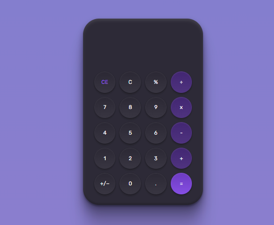

    <h1>Calculator</h1>
    
Challenge proposed by RocketSeat.

    

<h2>About the project:</h2>

A front-end project where we should had to develop a calculator based on the proposed layout. The code to make it work was optional, but I developed it to practice JavaScript.

<a href="https://www.figma.com/community/file/1202607074523509182">Layout</a> developed by 
Millena Kupsinskü Martins

<h2>Technologies:</h2>
<ul>
    <li>Html</li>
    <li>CSS</li>
    <li>Javascript</li>
</ul> 

<h2>Link:</h2>
<a href="https://calculatoronlinebr.netlify.app/">https://calculatoronlinebr.netlify.app/</a>

<h2>
<a href="https://github.com/AdrianoR85/Front-End"><-- BACK</a>
</h2>

