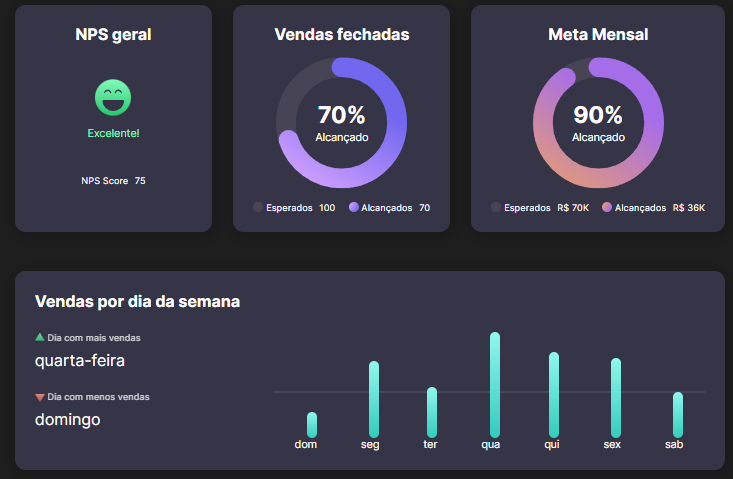
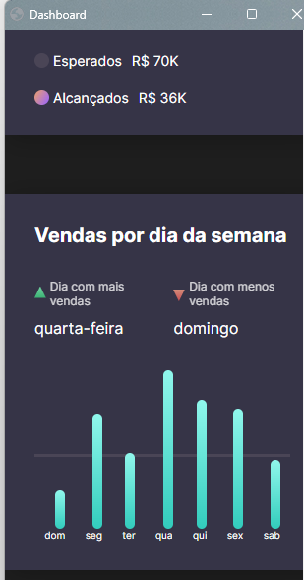

<div align="center">
    <h1>Dashboard</h1>
    <p>Challenge proposed by RocketSeat.</p>
    
    
</div>

<h2>About the project:</h2>
<p>A front-end project where we should had to develop a Dashboard based on the proposed layout.</p>
<p><a href="https://www.figma.com/community/file/1202607074523509182">Layout</a> developed by 
Millena Kupsinskü Martins</p>


## 🚀 Technologies:
<ul>
    <li>Html</li>
    <li>CSS</li>
    <li>SVG</li>
</ul> 

## 📚 Knowledge applied or acquired in the project:

```md
# CSS

- apply variable by attribute HTML
- animations / @keyframes
- column-gap / row-gap
- grid-template-columns / grid-template-rows / grid-column / grid-auto-flow
- fit-content
- place-content / align-self / justify-items / justify-content
- grid/flex/
- :nth-child() / ::before
- transform / matrix() / rotate()
- stroke / dasharray / dashoffset / stroke-width / linecap
- fill
- responsive layout / mobile first / @media
- clip-path / polygon
- linear-gradient()

# SVG

- viewBox
- circle
- cx / cy
- r
- stroke
- defs
- linearGradient
```

<h2>
<a href="https://github.com/AdrianoR85/Front-End"><-- BACK</a>
</h2>

