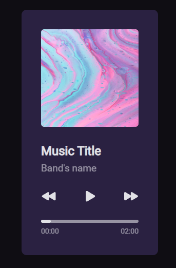

<div align="center">
    <h1>Music Player</h1>
    <p>Challenge proposed by RocketSeat.</p>
    
</div>

<h2>About the project:</h2>
<p>A front-end project where we should had to develop a Music Player based on the proposed layout.</p>
<p><a href="https://www.figma.com/community/file/1195050524500542670">Layout</a> developed by 
Daniel Duarte</p>


## 🚀 Technologies:
<ul>
    <li>Html</li>
    <li>CSS</li>
</ul> 

## 📚 Knowledge applied in the project:

```md
# CSS

    - Variable
    - grid/flex/
    - gap
    - place-content / align-self / justify-items / justify-content
    - transform / scale()
    - responsive layout
    - position / relative / absolute
    - pseudo-classe / hover / active

# HTML
    - Semantic

```

<h2>
<a href="https://github.com/AdrianoR85/Front-End"><-- BACK</a>
</h2>

