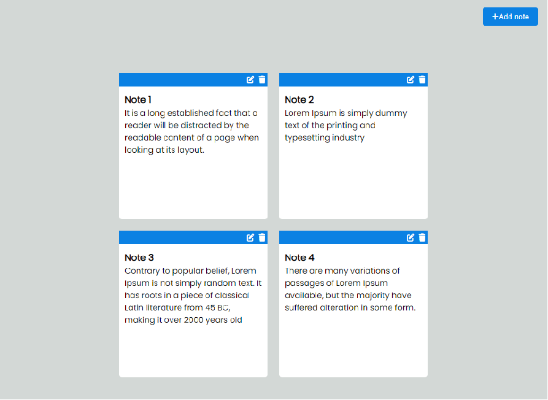

# Page under construction

<div align="center">
    <h1>Note App</h1>
    <p>Note Appp developed for practice.</p>
    
</div>

<h2>About the project:</h2>
<p>A front-end project where I develop a Note App </p>


## 🚀 Technologies:
<ul>
    <li>Html</li>
    <li>CSS</li>
    <li>JavaScript</li>
    <li>LocalStorage</li>

</ul>

## 📚 Knowledge applied in the project:

```md
# CSS
    - grid/flex/
    - gap
    - place-content / align-self / justify-items / justify-content
    - responsive layout
    - position / relative / absolute
    - pseudo-classe / hover / active
    - responsive
    - other

# JavaScript
    - addEventListener
    - splice
    - function
    - forEach
    - if else
    - insertAdjacentHTML

# LocalStorage
    - JSON.stringify
    - JSON.parse
    - localStorage.setItem
    - localStorage.getItem
```

<h2>
<a href="https://github.com/AdrianoR85/Front-End"><-- BACK</a>
</h2>
