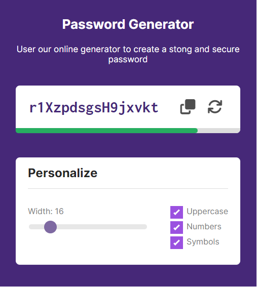

    <h1>Password Generator</h1>
    
Project developed in the Modern JavaScript Course.

    

<h2>About the project:</h2>

A password manager in which the user can select the amounts and types of characters that the password will have. According to the choices the Manager informs the password level

<h2>Technologies:</h2>
<ul>
    <li>Html Sematic</li>
    <li>CSS</li>
    <li>Javascript</li>
</ul> 

<h2>Link:</h2>
<a href="https://passwordgenerator64.netlify.app/">passwordgenerator64.netlify.app</a>
