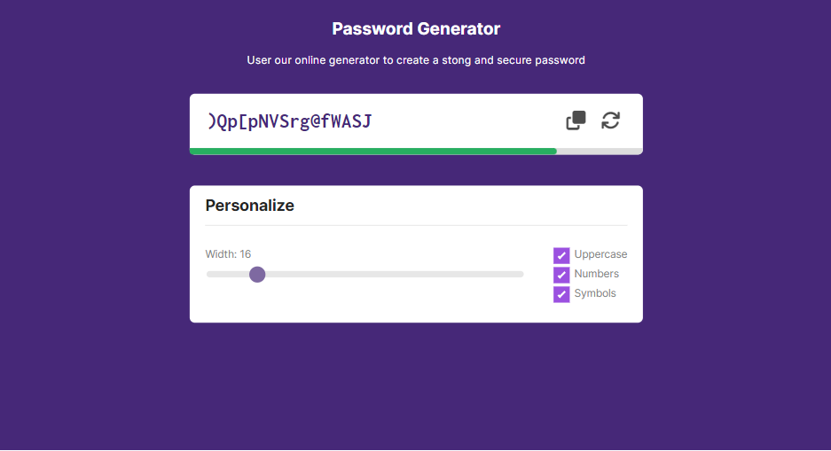

# Front-End Projectos

    All my front end projects that I developed for study or practice are here
      
    <table align="center">
        <tr align="center">
            <td width="300">
                
01-RocketNews

                
            </td>
            <td width="300">
                
02-Countdown

                
            </td>
        </tr>
        <tr align="center">
            <td width="300">
                
03-WebPage

                
            </td>
            <td width="300">
                
04-Adopet

                
            </td>
        </tr>
        <tr align="center">
            <td width="300">
                
05-movie-seat-booking

                
            </td>
            <td width="300">
                
06-Generator

                
            </td>
        </tr>
    </table>

